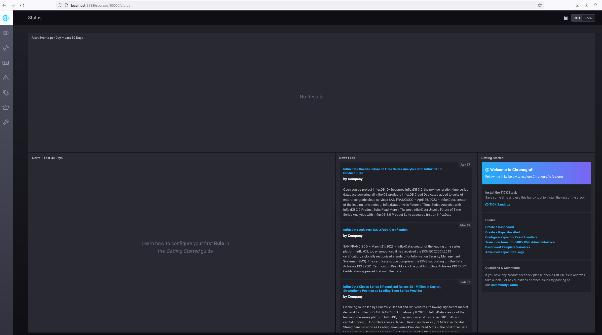
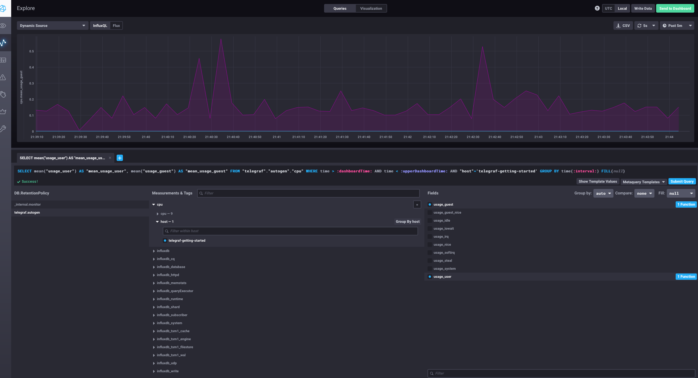
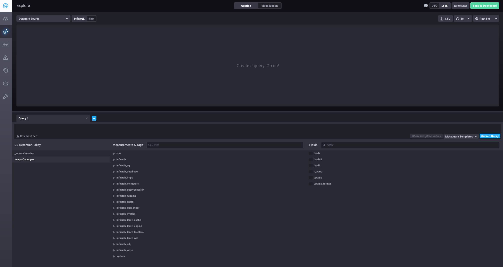

# Домашнее задание к занятию "13.Системы мониторинга"

## Обязательные задания

#### 1. Вас пригласили настроить мониторинг на проект. На онбординге вам рассказали, что проект представляет из себя 
платформу для вычислений с выдачей текстовых отчетов, которые сохраняются на диск. Взаимодействие с платформой 
осуществляется по протоколу http. Также вам отметили, что вычисления загружают ЦПУ. Какой минимальный набор метрик вы
выведите в мониторинг и почему?

Я бы предложил следующий минимальный набор метрик:

* Загрузка ЦПУ (CPU Usage): Поскольку вычисления загружают ЦПУ, важно отслеживать уровень его загрузки. Это поможет определить, достаточно ли мощностей ЦПУ для текущих задач или нужно масштабирование.
* Использование памяти (Memory Usage): Память также является критическим ресурсом в вычислительных системах. Мониторинг использования памяти поможет предотвратить ситуации, когда недостаток памяти может привести к сбоям или замедлению работы системы.
* Использование дискового пространства (Disk Usage): Так как отчеты сохраняются на диск, важно следить за доступным дисковым пространством, чтобы избежать проблем с сохранением данных.
* Сетевой трафик (Network Traffic): Мониторинг входящего и исходящего сетевого трафика важен, особенно если взаимодействие с платформой осуществляется по протоколу HTTP. Это помогает определить объем передаваемых данных и выявить потенциальные проблемы с производительностью сети.
* Количество запросов HTTP (HTTP Request Count): Отслеживание количества и типа HTTP-запросов поможет понять нагрузку на сервер и выявить аномальные паттерны использования.
* Время отклика сервера (Server Response Time): Время, необходимое серверу для обработки запроса и отправки ответа, является ключевым показателем производительности. Мониторинг времени отклика поможет выявить узкие места в производительности.
* Логи ошибок (Error Logs): Ведение и анализ логов ошибок поможет оперативно выявлять и устранять проблемы в системе.

#### 2. Менеджер продукта посмотрев на ваши метрики сказал, что ему непонятно что такое RAM/inodes/CPUla. Также он сказал, 
что хочет понимать, насколько мы выполняем свои обязанности перед клиентами и какое качество обслуживания. Что вы 
можете ему предложить?

Можно предложить более понятные метрики:

* Время Обработки Запроса (Request Processing Time): Это время, необходимое для полной обработки запроса клиентом. Эта метрика поможет понять, насколько быстро система реагирует на запросы пользователей.
* Процент Успешных Запросов (Success Rate): Процент запросов, которые успешно обработаны и получили положительный ответ, в сравнении с общим числом запросов. Это показывает надежность и доступность системы.
* Время Недоступности Системы (System Downtime): Общее время, в течение которого система не была доступна для пользователей. Минимизация времени простоя улучшает общее качество обслуживания.
* Количество и Типы Ошибок (Error Types and Counts): Анализ типов и частоты ошибок поможет определить, какие аспекты системы нуждаются в улучшении.
* Время Реагирования на Инциденты (Incident Response Time): Время, необходимое для реагирования и устранения инцидентов. Быстрое реагирование повышает доверие клиентов.
* Среднее Время Решения Проблем (Mean Time to Resolution, MTTR): Среднее время, необходимое для устранения проблемы после ее возникновения. Это важный показатель эффективности поддержки и обслуживания.

#### 3. Вашей DevOps команде в этом году не выделили финансирование на построение системы сбора логов. Разработчики в свою 
очередь хотят видеть все ошибки, которые выдают их приложения. Какое решение вы можете предпринять в этой ситуации, 
чтобы разработчики получали ошибки приложения?

* Использование Open Source Решений: Существует бесплатные и инструменты для сбора и анализа логов (Prometheus, Logstash, Kibana, Sentry и пр). Эти системы могут быть настроены для сбора, агрегации и визуализации логов, что позволит разработчикам анализировать ошибки.

* Логирование в Файлы и Ручной Анализ: Если ресурсы ограничены, можно настроить приложения на логирование ошибок непосредственно в файлы на сервере. Затем разработчики могут периодически просматривать эти файлы или использовать простые скрипты для извлечения и анализа важной информации.

* Интеграция с Системами Управления Инцидентами: Можно настроить приложения таким образом, чтобы ошибки автоматически отправлялись в системы управления инцидентами (например, Jira, Redmine), где они могут быть классифицированы и отслеживаны.

#### 4. Вы, как опытный SRE, сделали мониторинг, куда вывели отображения выполнения SLA=99% по http кодам ответов. 
Вычисляете этот параметр по следующей формуле: summ_2xx_requests/summ_all_requests. Данный параметр не поднимается выше 
70%, но при этом в вашей системе нет кодов ответа 5xx и 4xx. Где у вас ошибка?

Скорее всего, проблема кроется в неучете других типов HTTP-кодов ответов, которые также считаются успешными. Ошибкой здесь является ограничение расчета только кодами 2xx.

В HTTP существуют следующие классы статусных кодов:

* 1xx (Информационные): Эти коды не являются ошибками и могут указывать на успешное начало процесса обработки запроса.
* 2xx (Успех): Эти коды означают, что запрос успешно обработан.
* 3xx (Перенаправление): Коды перенаправления также не являются ошибками. Они указывают, что для успешного выполнения запроса требуется дополнительное действие, например, перенаправление на другой URL.
* 4xx (Ошибки клиента): Эти ошибки указывают на проблемы на стороне клиента.
* 5xx (Ошибки сервера): Эти ошибки указывают на проблемы на стороне сервера.

Для корректного расчета SLA, особенно если важно отслеживать доступность и эффективность обслуживания, вам следует учитывать все успешные ответы, включая 1xx, 2xx и, возможно, 3xx коды. Таким образом, более адекватная формула для расчета SLA может быть следующей:

SLA = (сумма запросов с кодами 1xx, 2xx, 3xx сумма всех запросов) / сумма всех запросов
​	

#### 5. Опишите основные плюсы и минусы pull и push систем мониторинга.

##### Pull-системы мониторинга

Плюсы:

* Централизованный Контроль: Сервер мониторинга сам запрашивает данные с агентов, что позволяет более строго контролировать сбор данных.
* Безопасность: Обычно безопаснее, так как агенты не отправляют данные активно, и сервер мониторинга инициирует соединение.
* Упрощение Фаервола и Сетевой Конфигурации: Только сервер мониторинга должен иметь доступ через фаервол, уменьшая необходимость в настройке сети на клиентских машинах.
* Стандартизация: Проще обеспечить стандартизацию сбора данных.

Минусы:

* Масштабируемость: Может страдать при большом количестве агентов, так как серверу необходимо активно опрашивать каждый из них.
* Задержка Данных: Может быть задержка в данных, так как сервер опрашивает агенты с определенной периодичностью.
* Сложность Конфигурации: Настройка агентов может быть сложнее, поскольку им нужно разрешить соединения от сервера.
* Проблемы с Доступностью: Если сервер мониторинга недоступен, данные с агентов не собираются.

##### Push-системы мониторинга

Плюсы:

* Масштабируемость: Лучше масштабируются, так как агенты активно отправляют данные, уменьшая нагрузку на сервер.
* Текущие Данные: Данные обычно более актуальные, так как отправляются агентами в режиме реального времени.
* Гибкость: Легче настроить для различных сценариев, включая динамические облачные среды.
* Устойчивость к Сбоям: Если сервер мониторинга временно недоступен, агенты могут кэшировать данные и отправить их позже.

Минусы:

* Безопасность: Требуют больше настроек безопасности, так как агенты активно отправляют данные на сервер.
* Сложность Настройки Сети: Необходимо настроить фаерволы и сеть для разрешения исходящего трафика от агентов.
* Потенциальное Перегрузка Сервера: Если множество агентов одновременно отправляют данные, сервер может быть перегружен.
* Управление Конфигурацией: Может быть сложнее управлять и поддерживать конфигурации на стороне агентов.

#### 6. Какие из ниже перечисленных систем относятся к push модели, а какие к pull? А может есть гибридные?

    - Prometheus <br>
    pull модель

    - TICK<br>
    гибриная модель

    - Zabbix<br>
    гибриная модель

    - VictoriaMetrics<br>
    гибриная модель

    - Nagios<br>
    pull модель

#### 7. Склонируйте себе [репозиторий](https://github.com/influxdata/sandbox/tree/master) и запустите TICK-стэк, 
используя технологии docker и docker-compose.

В виде решения на это упражнение приведите скриншот веб-интерфейса ПО chronograf (`http://localhost:8888`). 

P.S.: если при запуске некоторые контейнеры будут падать с ошибкой - проставьте им режим `Z`, например
`./data:/var/lib:Z`



#### 8. Перейдите в веб-интерфейс Chronograf (http://localhost:8888) и откройте вкладку Data explorer.
        
    - Нажмите на кнопку Add a query
    - Изучите вывод интерфейса и выберите БД telegraf.autogen
    - В `measurments` выберите cpu->host->telegraf-getting-started, а в `fields` выберите usage_system. Внизу появится график утилизации cpu.
    - Вверху вы можете увидеть запрос, аналогичный SQL-синтаксису. Поэкспериментируйте с запросом, попробуйте изменить группировку и интервал наблюдений.

Для выполнения задания приведите скриншот с отображением метрик утилизации cpu из веб-интерфейса.



#### 9. Изучите список [telegraf inputs](https://github.com/influxdata/telegraf/tree/master/plugins/inputs). 
Добавьте в конфигурацию telegraf следующий плагин - [docker](https://github.com/influxdata/telegraf/tree/master/plugins/inputs/docker):
```
[[inputs.docker]]
  endpoint = "unix:///var/run/docker.sock"
```

Дополнительно вам может потребоваться донастройка контейнера telegraf в `docker-compose.yml` дополнительного volume и 
режима privileged:
```
  telegraf:
    image: telegraf:1.4.0
    privileged: true
    volumes:
      - ./etc/telegraf.conf:/etc/telegraf/telegraf.conf:Z
      - /var/run/docker.sock:/var/run/docker.sock:Z
    links:
      - influxdb
    ports:
      - "8092:8092/udp"
      - "8094:8094"
      - "8125:8125/udp"
```

После настройке перезапустите telegraf, обновите веб интерфейс и приведите скриншотом список `measurments` в 
веб-интерфейсе базы telegraf.autogen . Там должны появиться метрики, связанные с docker.


Я изменил `docker-compose.yml`:

```yml
version: '3'
services:
  influxdb:
    # Full tag list: https://hub.docker.com/r/library/influxdb/tags/
    build:
      context: ./images/influxdb/
      dockerfile: ./${TYPE}/Dockerfile
      args:
        INFLUXDB_TAG: ${INFLUXDB_TAG}
    image: "influxdb"
    volumes:
      # Mount for influxdb data directory
      - ./influxdb/data:/var/lib/influxdb
      # Mount for influxdb configuration
      - ./influxdb/config/:/etc/influxdb/
    ports:
      # The API for InfluxDB is served on port 8086
      - "8086:8086"
      - "8082:8082"
      # UDP Port
      - "8089:8089/udp"

  telegraf:
    # Full tag list: https://hub.docker.com/r/library/telegraf/tags/
    build:
      context: ./images/telegraf/
      dockerfile: ./${TYPE}/Dockerfile
      args:
        TELEGRAF_TAG: ${TELEGRAF_TAG}
    image: "telegraf:1.4.0"
    privileged: true
    environment:
      HOSTNAME: "telegraf-getting-started"
    links:
      - influxdb
    volumes:
      - ./telegraf/:/etc/telegraf/
      - /var/run/docker.sock:/var/run/docker.sock
      - ./etc/:/etc/telegraf/:Z
    depends_on:
      - influxdb
    ports:
      - "8092:8092/udp"
      - "8094:8094"
      - "8125:8125/udp"

  kapacitor:
  # Full tag list: https://hub.docker.com/r/library/kapacitor/tags/
    build:
      context: ./images/kapacitor/
      dockerfile: ./${TYPE}/Dockerfile
      args:
        KAPACITOR_TAG: ${KAPACITOR_TAG}
    image: "kapacitor"
    volumes:
      # Mount for kapacitor data directory
      - ./kapacitor/data/:/var/lib/kapacitor
      # Mount for kapacitor configuration
      - ./kapacitor/config/:/etc/kapacitor/
    # Kapacitor requires network access to Influxdb
    links:
      - influxdb
    ports:
      # The API for Kapacitor is served on port 9092
      - "9092:9092"

  chronograf:
    # Full tag list: https://hub.docker.com/r/library/chronograf/tags/
    build:
      context: ./images/chronograf
      dockerfile: ./${TYPE}/Dockerfile
      args:
        CHRONOGRAF_TAG: ${CHRONOGRAF_TAG}
    image: "chrono_config"
    environment:
      RESOURCES_PATH: "/usr/share/chronograf/resources"
    volumes:
      # Mount for chronograf database
      - ./chronograf/data/:/var/lib/chronograf/
    links:
      # Chronograf requires network access to InfluxDB and Kapacitor
      - influxdb
      - kapacitor
    ports:
      # The WebUI for Chronograf is served on port 8888
      - "8888:8888"
    depends_on:
      - kapacitor
      - influxdb
      - telegraf

  documentation:
    build:
      context: ./documentation
    ports:
      - "3010:3000"

```

Но метрики связанные с docker не появились


