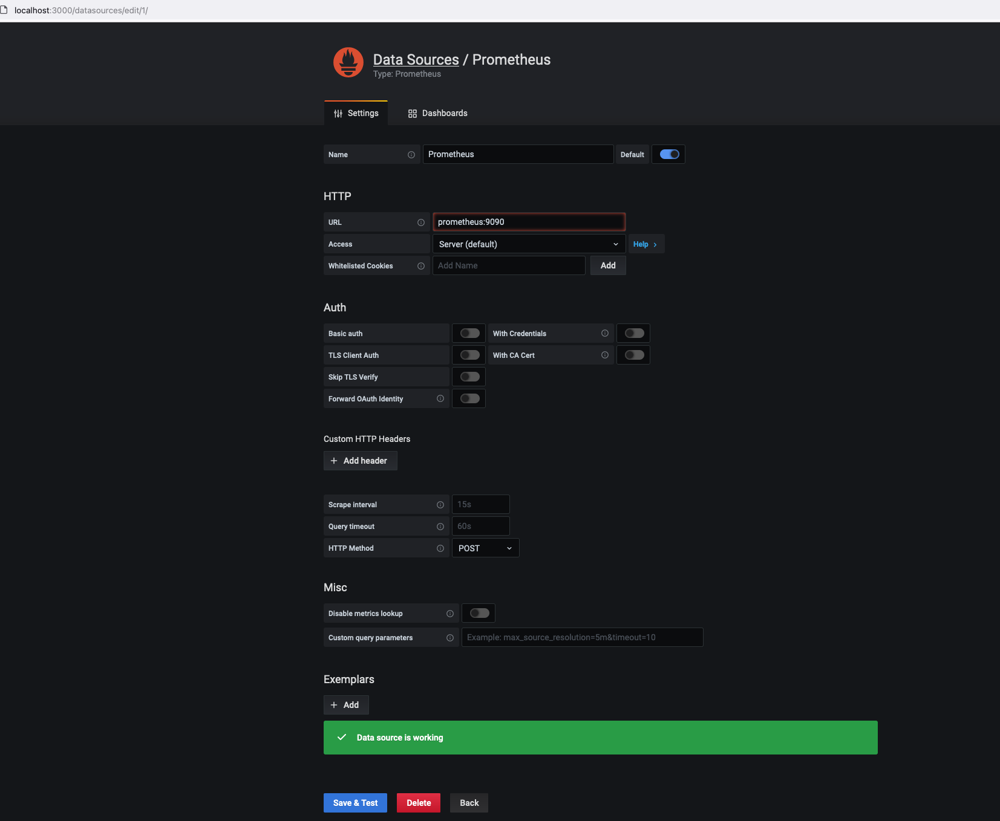
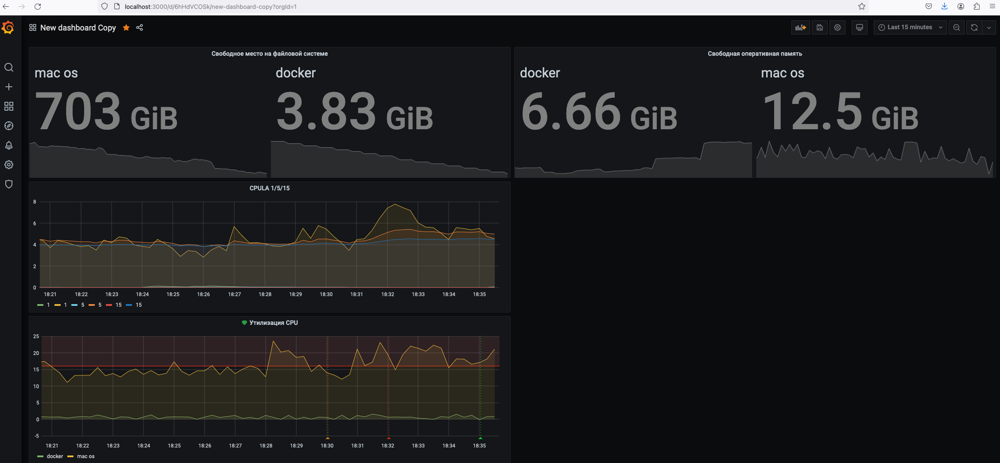
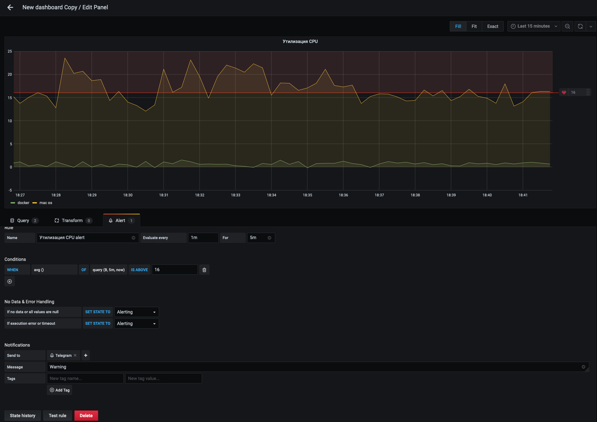
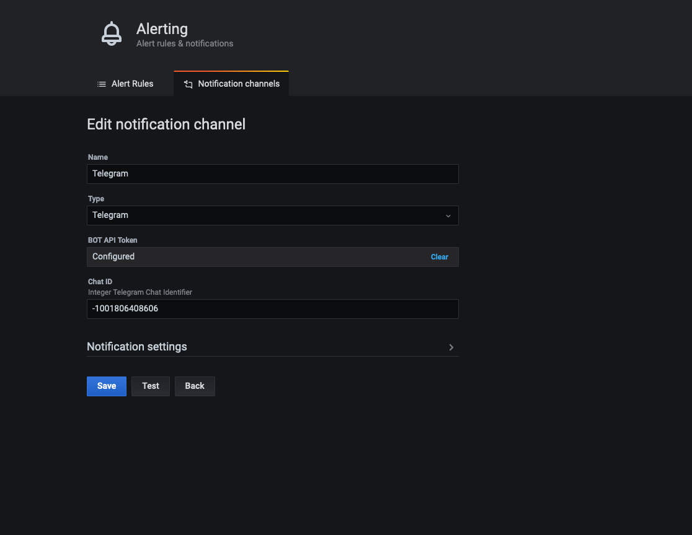

# Домашнее задание к занятию 14 «Средство визуализации Grafana»


## Обязательные задания

### Задание 1

1. Используя директорию [help](./help) внутри этого домашнего задания, запустите связку prometheus-grafana.
1. Зайдите в веб-интерфейс grafana, используя авторизационные данные, указанные в манифесте docker-compose.
1. Подключите поднятый вами prometheus, как источник данных.
1. Решение домашнего задания — скриншот веб-интерфейса grafana со списком подключенных Datasource.

```bash
выполнено
```



## Задание 2

Изучите самостоятельно ресурсы:

1. [PromQL tutorial for beginners and humans](https://valyala.medium.com/promql-tutorial-for-beginners-9ab455142085).
1. [Understanding Machine CPU usage](https://www.robustperception.io/understanding-machine-cpu-usage).
1. [Introduction to PromQL, the Prometheus query language](https://grafana.com/blog/2020/02/04/introduction-to-promql-the-prometheus-query-language/).

Создайте Dashboard и в ней создайте Panels:

- утилизация CPU для nodeexporter (в процентах, 100-idle);

```bash
100 - (avg by (instance) (irate(node_cpu_seconds_total{instance="nodeexporter_docker", mode="idle"}[5m])) * 100)
100 - (avg by (instance) (irate(node_cpu_seconds_total{instance="nodeexporter_mac_os", mode="idle"}[5m])) * 100)
```

- CPULA 1/5/15;

```bash
node_load1
node_load5
node_load15
```

- количество свободной оперативной памяти;

```bash
node_memory_MemAvailable_bytes {instance="nodeexporter_docker"}
node_memory_inactive_bytes {instance="nodeexporter_mac_os"} 
```

- количество места на файловой системе.

```bash
node_filesystem_free_bytes{instance="nodeexporter_mac_os", mountpoint="/"}
node_filesystem_free_bytes{instance="nodeexporter_docker", mountpoint="/"}
```



## Задание 3

1. Создайте для каждой Dashboard подходящее правило alert — можно обратиться к первой лекции в блоке «Мониторинг».
1. В качестве решения задания приведите скриншот вашей итоговой Dashboard.

```bash
выполнено
```





## Задание 4

1. Сохраните ваш Dashboard.Для этого перейдите в настройки Dashboard, выберите в боковом меню «JSON MODEL». Далее скопируйте отображаемое json-содержимое в отдельный файл и сохраните его.
1. В качестве решения задания приведите листинг этого файла.

```bash
выполнено
```

[Dashboard model](dashboard.json)


