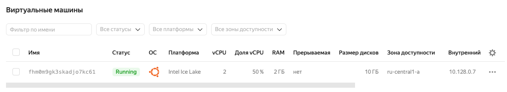

# Домашнее задание к занятию "5.4. Оркестрация группой Docker контейнеров на примере Docker Compose"

---

## Задача 1

Создайте собственный образ любой операционной системы (например, debian-11) с помощью Packer версии 1.5.0 <br>

Выполнено.

```bash
vagrant@sysadm-fs2:~/netology/5.4$ yc compute image list
+----------------------+-----------------+-----------------+----------------------+--------+
|          ID          |      NAME       |     FAMILY      |     PRODUCT IDS      | STATUS |
+----------------------+-----------------+-----------------+----------------------+--------+
| fd8h5s43vg85il9rvfcp | ubuntu2204-base | ubuntu-2204-lts | f2enl84qjndap4o41aev | READY  |
+----------------------+-----------------+-----------------+----------------------+--------+

```

## Задача 2

Создайте вашу первую виртуальную машину в YandexCloud с помощью web-интерфейса YandexCloud.<br>

Выполнено.



## Задача 3

С помощью Ansible и Docker Compose разверните на виртуальной машине из предыдущего задания систему мониторинга на основе Prometheus/Grafana. Используйте Ansible-код в директории (src/ansible). <br>

Я установил ansible, прописал файл конфигурации и inventory:

```bash
vagrant@sysadm-fs2:/etc/ansible$ cat ansible.cfg
[defaults]
inventory=./inventory
deprecation_warnings=False
command_warnings=False
ansible_port=22

vagrant@sysadm-fs2:/etc/ansible$ cat inventory
[nodes:children]
manager

[manager]
node01.netology.cloud ansible_host=158.160.118.69
vagrant@sysadm-fs2:/etc/ansible$
```

Ansible работает:

```bash
vagrant@sysadm-fs2:/etc/ansible$ ansible all -a "df -h" -u netology
node01.netology.cloud | CHANGED | rc=0 >>
Filesystem      Size  Used Avail Use% Mounted on
tmpfs           197M  1.2M  196M   1% /run
/dev/vda2       9.8G  3.9G  5.5G  42% /
tmpfs           982M     0  982M   0% /dev/shm
tmpfs           5.0M     0  5.0M   0% /run/lock
tmpfs           197M  4.0K  197M   1% /run/user/1001
```

Я создал images c помощью `docker compose`

```
vagrant@sysadm-fs2:~/netology/5.4$ sudo docker-compose images
Container           Repository                 Tag                 Image Id            Size
alertmanager        prom/alertmanager          v0.20.0             0881eb8f169f        52.1MB
caddy               stefanprodan/caddy         latest              655880563633        24.7MB
cadvisor            gcr.io/cadvisor/cadvisor   v0.47.0             b2a3c8cd6153        87.3MB
grafana             grafana/grafana            7.4.2               db33d19bd973        198MB
nodeexporter        prom/node-exporter         v0.18.1             e5a616e4b9cf        22.9MB
prometheus          prom/prometheus            v2.17.1             358a0d2395fe        135MB
pushgateway         prom/pushgateway           v1.2.0              35eb99337fe3        19.4MB
```

Но запустить я не могу, т.к. при выполнении `docker-compose up`
выходит ошибки об отсутствии файлов

```
err="error loading config from \"/etc/prometheus/prometheus.yml\": couldn't load configuration (--config.file=\"/etc/prometheus/prometheus.yml\"): open /etc/prometheus/prometheus.yml: no such file or directory"
```
В тоже время файл конфигурации указан:

```
vagrant@sysadm-fs2:~/netology/5.4$ ll /etc/prometheus/
total 26612
drwxr-xr-x   2 root root     4096 Aug  9 14:10 ./
drwxr-xr-x 106 root root     4096 Aug  9 13:56 ../
-rw-r--r--   1 root root     2433 Aug  9 13:53 alert.rules
-rw-r--r--   1 root root 13625550 Aug  9 14:13 ctop-0.7.6-linux-amd64
-rw-r--r--   1 root root 13606047 Aug  9 14:11 ctop-0.7.7-linux-amd64
-rw-r--r--   1 root root     1279 Aug  9 13:54 prometheus.yml
```

**Вопросы:** <br>

1.
Файлы конфигурации я добавлял вручную, т.е. я создавал папки и копировал туда файлы конфигурации. Правильно ли это? Или мне нужно было поставить `prometheus`, `grafana` и т.д. ? <br>

2.
Почему возникает вышестоящая ошибка с отсутствием файлов? Мы ведь подключаем том с конфигурационным файлом ?

```bash
    volumes:
      - ./prometheus:/etc/prometheus
```


3.
Мне нужно использовать ansible код. Как мне связать ansible и docker-compose? С помощью ansible я могу запускать команды на группе серверов. А docker-compose я использую чтобы развернуть несколько виртуальных машин с микросервисами. И чтобы это сделать я ввожу команду `docker-compose up` 
Начинается выполнение кода в файле `docker-compose.yml`. А ansible?

4.
Также не понятно назначение файла `provision.yml`. <br>
`provision.yml` это тоже самое что и `playbook.yml` ?

5.
Мне нужно запустить `ansible` с указанием `provision.yml` для того чтобы на удаленном сервере поставился `docker` и далее на удаленной машине запустить `docker compose` чтобы там установились все микросервисы?