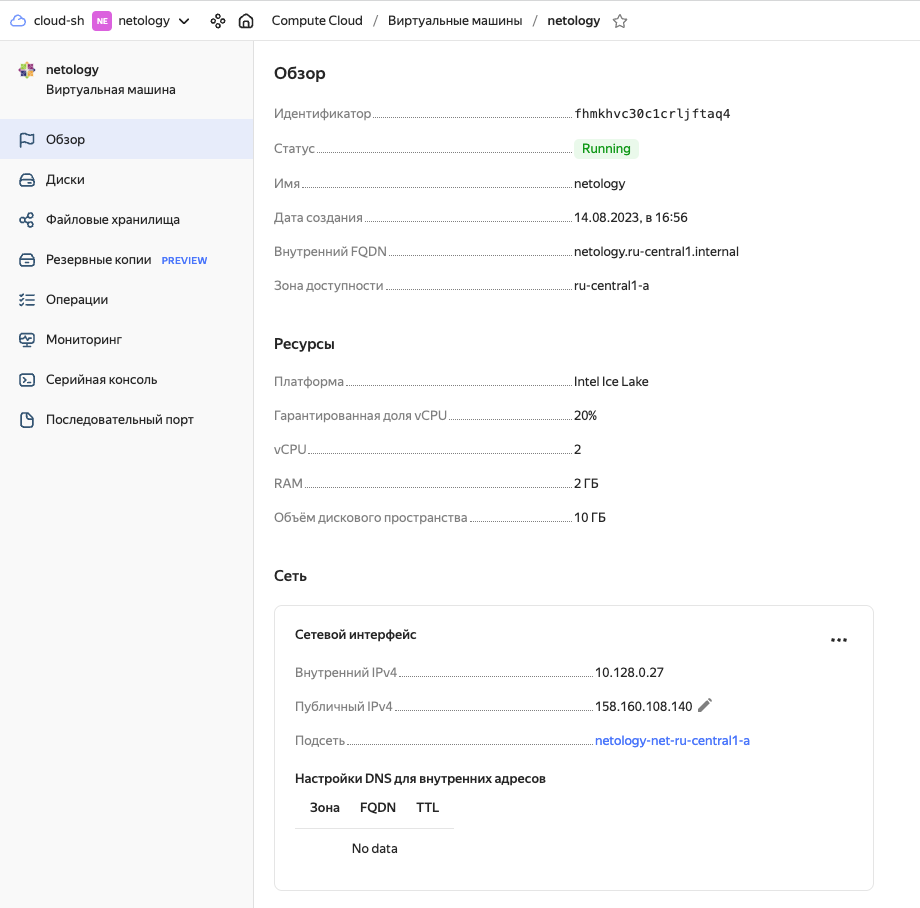
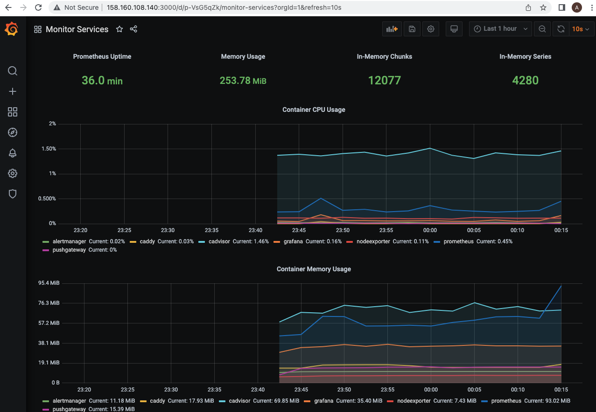

# Домашнее задание к занятию "5.4. Оркестрация группой Docker контейнеров на примере Docker Compose"

---

## Задача 1

Создайте собственный образ любой операционной системы (например, debian-11) с помощью Packer версии 1.5.0 <br>

Выполнено.

```bash
vagrant@sysadm-fs2:~/netology/5.4$ yc compute image list
+----------------------+-----------------+-----------------+----------------------+--------+
|          ID          |      NAME       |     FAMILY      |     PRODUCT IDS      | STATUS |
+----------------------+-----------------+-----------------+----------------------+--------+
| fd8h5s43vg85il9rvfcp | ubuntu2204-base | ubuntu-2204-lts | f2enl84qjndap4o41aev | READY  |
+----------------------+-----------------+-----------------+----------------------+--------+

```

## Задача 2

Создайте вашу первую виртуальную машину в YandexCloud с помощью web-интерфейса YandexCloud.<br>

Выполнено.



## Задача 3

С помощью Ansible и Docker Compose разверните на виртуальной машине из предыдущего задания систему мониторинга на основе Prometheus/Grafana. Используйте Ansible-код в директории (src/ansible). <br>

```
root@sysadm-fs2:/home/vagrant/netology/5.4/3/ansible# ansible all -a "sudo docker ps" -u netology
node01.netology.cloud | CHANGED | rc=0 >>
CONTAINER ID   IMAGE                              COMMAND                  CREATED         STATUS                   PORTS                                                                              NAMES
e04935a0fee6   gcr.io/cadvisor/cadvisor:v0.47.0   "/usr/bin/cadvisor -…"   2 minutes ago   Up 2 minutes (healthy)   8080/tcp                                                                           cadvisor
d3cf0e2f0c66   prom/alertmanager:v0.20.0          "/bin/alertmanager -…"   2 minutes ago   Up 2 minutes             9093/tcp                                                                           alertmanager
30570d9aecaf   prom/prometheus:v2.17.1            "/bin/prometheus --c…"   2 minutes ago   Up 2 minutes             9090/tcp                                                                           prometheus
01ea8568d04e   stefanprodan/caddy                 "/sbin/tini -- caddy…"   2 minutes ago   Up 2 minutes             0.0.0.0:3000->3000/tcp, 0.0.0.0:9090-9091->9090-9091/tcp, 0.0.0.0:9093->9093/tcp   caddy
00d32acadc47   grafana/grafana:7.4.2              "/run.sh"                2 minutes ago   Up 2 minutes             3000/tcp                                                                           grafana
204185de04b2   prom/node-exporter:v0.18.1         "/bin/node_exporter …"   2 minutes ago   Up 2 minutes             9100/tcp                                                                           nodeexporter
ac1ae49d79d8   prom/pushgateway:v1.2.0            "/bin/pushgateway"       2 minutes ago   Up 2 minutes             9091/tcp                                                                           pushgateway
```

## Задача 4

