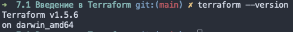
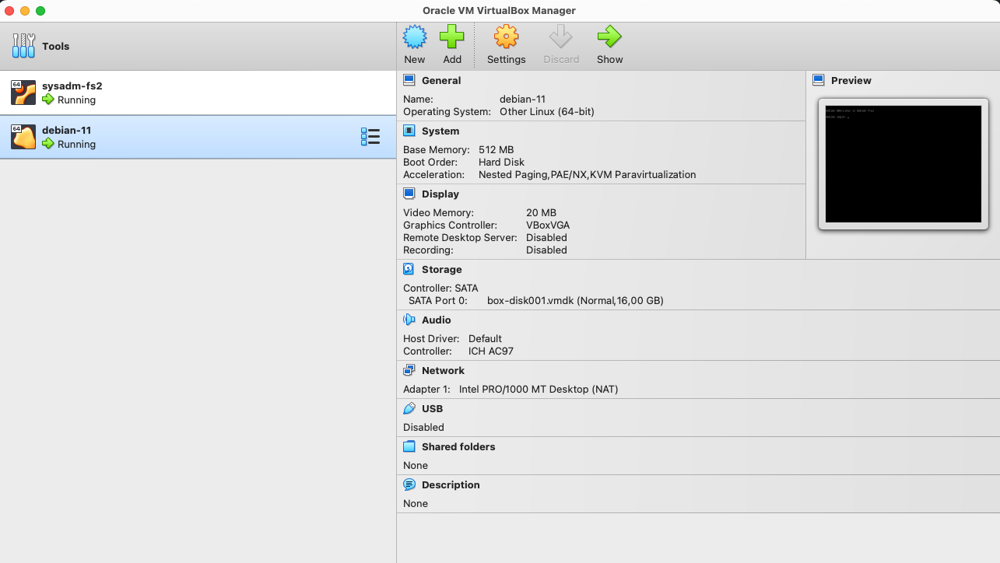

# Домашнее задание к занятию «Введение в Terraform»


### Чек-лист готовности к домашнему заданию

1. Скачайте и установите актуальную версию **Terraform** >=1.4.X . Приложите скриншот вывода команды ```terraform --version```.



2. Скачайте на свой ПК этот git-репозиторий. Исходный код для выполнения задания расположен в директории **01/src**.

```
выполнено
```

3. Убедитесь, что в вашей ОС установлен docker.

```
выполнено
```

4. Зарегистрируйте аккаунт на сайте https://hub.docker.com/, выполните команду docker login и введите логин, пароль.

```
выполнено
```
------


### Задание 1

#### **1. Перейдите в каталог [**src**](https://github.com/netology-code/ter-homeworks/tree/main/01/src). Скачайте все необходимые зависимости, использованные в проекте.**

```bash
Initializing the backend...

Initializing provider plugins...
- Finding kreuzwerker/docker versions matching "~> 3.0.1"...
- Finding latest version of hashicorp/random...
- Installing kreuzwerker/docker v3.0.2...
- Installed kreuzwerker/docker v3.0.2 (self-signed, key ID BD080C4571C6104C)
- Installing hashicorp/random v3.5.1...
- Installed hashicorp/random v3.5.1 (signed by HashiCorp)

Partner and community providers are signed by their developers.
If you'd like to know more about provider signing, you can read about it here:
https://www.terraform.io/docs/cli/plugins/signing.html

Terraform has created a lock file .terraform.lock.hcl to record the provider
selections it made above. Include this file in your version control repository
so that Terraform can guarantee to make the same selections by default when
you run "terraform init" in the future.

Terraform has been successfully initialized!

You may now begin working with Terraform. Try running "terraform plan" to see
any changes that are required for your infrastructure. All Terraform commands
should now work.

If you ever set or change modules or backend configuration for Terraform,
rerun this command to reinitialize your working directory. If you forget, other
commands will detect it and remind you to do so if necessary.
```   

#### 2. Изучите файл **.gitignore**. В каком terraform-файле, согласно этому .gitignore, допустимо сохранить личную, секретную информацию?
В файле `personal.auto.tfvars`, также в файлах с расширением `*.tfstate`

#### 3. Выполните код проекта. Найдите в state-файле секретное содержимое созданного ресурса **random_password**, пришлите в качестве ответа конкретный ключ и его значение.

```
"result": "9bLqqI2h0wYfGcvb"
```

#### 4. Раскомментируйте блок кода, примерно расположенный на строчках 29–42 файла **main.tf**.
```
выполнено
```

#### 5. Выполните команду ```terraform validate```. Объясните, в чём заключаются намеренно допущенные ошибки. Исправьте их.

```
➜  7.1 Введение в Terraform git:(main) ✗ terraform validate 
╷
│ Error: Invalid resource name
│ 
│   on main.tf line 30, in resource "docker_container" "1nginx":
│   30: resource "docker_container" "1nginx" {
│ 
│ A name must start with a letter or underscore and may contain only letters, digits, underscores, and dashes.
```
Имя должно начинаться с буквы или нижнего подчеркивания.
Исправляем: `1nginx` -> `nginx`

```
Error: Reference to undeclared resource
│ 
│   on main.tf line 32, in resource "docker_container" "nginx":
│   32:   name  = "example_${random_password.random_string_FAKE.resulT}"
│ 
│ A managed resource "random_password" "random_string_FAKE" has not been declared in the root module.
```
Ресурс `random_string_FAKE` не объявлен в корневом модуле.
У нас есть ресурс `random_password`, ставим его.

```
│ Error: Missing name for resource
│ 
│   on main.tf line 23, in resource "docker_image":
│   23: resource "docker_image" {
│ 
│ All resource blocks must have 2 labels (type, name).
```
нужно добавить имя ресурса, добавляем: `resource "docker_image" "nginx"`

#### 6. Выполните код. В качестве ответа приложите вывод команды ```docker ps```.

```
 7.1 Введение в Terraform git:(main) ✗ docker ps
CONTAINER ID   IMAGE          COMMAND                  CREATED         STATUS         PORTS                  NAMES
92a98252bc29   f9c14fe76d50   "/docker-entrypoint.…"   5 seconds ago   Up 4 seconds   0.0.0.0:8000->80/tcp   example_9bLqqI2h0wYfGcvb
```


#### 7. Замените имя docker-контейнера в блоке кода на ```hello_world```. Не перепутайте’ имя контейнера и имя образа. Мы всё ещё продолжаем использовать name = "nginx:latest". Выполните команду ```terraform apply -auto-approve```.
Объясните своими словами, в чём может быть опасность применения ключа  ```-auto-approve```. В качестве ответа дополнительно приложите вывод команды ```docker ps```.

кусок кода будет таким:
```
resource "docker_image" "hello_world" {
  name         = "nginx:latest"
  keep_locally = true
}

resource "docker_container" "nginx" {
  image = docker_image.hello_world.image_id
  name  = "example_${random_password.random_string.result}"
  ```

Команда `terraform apply -auto-approve` в Terraform выполняет применение вашей инфраструктуры без запроса подтверждения. Это означает, что Terraform выполнит изменения, описанные в конфигурации инфраструктуры, без предварительного запроса. В случае ошибки, неправильного описания и т.д. - все изменения будут применены.

```
➜  7.1 Введение в Terraform git:(main) ✗ docker ps                    
CONTAINER ID   IMAGE          COMMAND                  CREATED         STATUS         PORTS                  NAMES
7f17c70df3a3   f9c14fe76d50   "/docker-entrypoint.…"   3 seconds ago   Up 2 seconds   0.0.0.0:8000->80/tcp   example_9bLqqI2h0wYfGcvb
```

#### 8. Уничтожьте созданные ресурсы с помощью **terraform**. Убедитесь, что все ресурсы удалены. Приложите содержимое файла **terraform.tfstate**. 

```
terraform destroy
```

```
➜  7.1 Введение в Terraform git:(main) ✗ cat terraform.tfstate 
{
  "version": 4,
  "terraform_version": "1.5.6",
  "serial": 28,
  "lineage": "c898146f-0615-1531-46c8-299249f74b19",
  "outputs": {},
  "resources": [],
  "check_results": null
}
```

#### 9. Объясните, почему при этом не был удалён docker-образ **nginx:latest**. Ответ подкрепите выдержкой из документации [**terraform провайдера docker**](https://docs.comcloud.xyz/providers/kreuzwerker/docker/latest/docs).

Потому что был указан параметр `keep_locally = true`. <br>
If true, then the Docker image won't be deleted on destroy operation. If this is false, it will delete the image from the docker local storage on destroy operation.

## Дополнительное задание (со звёздочкой*)


### Задание 2*

1. Изучите в документации provider [**Virtualbox**](https://docs.comcloud.xyz/providers/shekeriev/virtualbox/latest/docs) от 
shekeriev.
2. Создайте с его помощью любую виртуальную машину. Чтобы не использовать VPN, советуем выбрать любой образ с расположением в GitHub из [**списка**](https://www.vagrantbox.es/).

В качестве ответа приложите plan для создаваемого ресурса и скриншот созданного в VB ресурса. 

файл `main.tf`

```bash
terraform {
  required_providers {
    virtualbox = {
      source  = "shekeriev/virtualbox"
      version = "0.0.4"
    }
  }
}

provider "virtualbox" {
  delay      = 60
  mintimeout = 5
}

resource "virtualbox_vm" "vm1" {
  name   = "debian-11"
  image  = "https://app.vagrantup.com/shekeriev/boxes/debian-11/versions/0.2/providers/virtualbox.box"
  cpus   = 1
  memory = "512 mib"


  network_adapter {
    type           = "nat"
    device         = "IntelPro1000MTDesktop"
    host_interface = "vboxnet1"
  }
}

```
```bash
2 git:(main) ✗ terraform plan

Terraform used the selected providers to generate the following execution plan. Resource actions are indicated with the following symbols:
  + create

Terraform will perform the following actions:

  # virtualbox_vm.vm1 will be created
  + resource "virtualbox_vm" "vm1" {
      + cpus   = 1
      + id     = (known after apply)
      + image  = "https://app.vagrantup.com/shekeriev/boxes/debian-11/versions/0.2/providers/virtualbox.box"
      + memory = "512 mib"
      + name   = "debian-11"
      + status = "running"

      + network_adapter {
          + device                 = "IntelPro1000MTDesktop"
          + host_interface         = "vboxnet1"
          + ipv4_address           = (known after apply)
          + ipv4_address_available = (known after apply)
          + mac_address            = (known after apply)
          + status                 = (known after apply)
          + type                   = "nat"
        }
    }

Plan: 1 to add, 0 to change, 0 to destroy.
```

