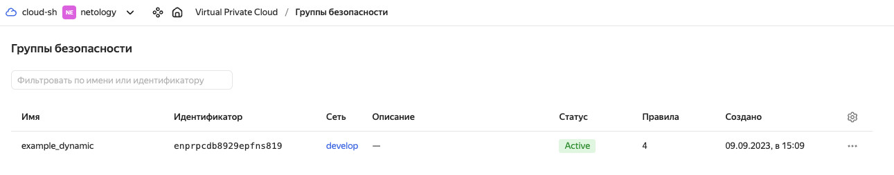
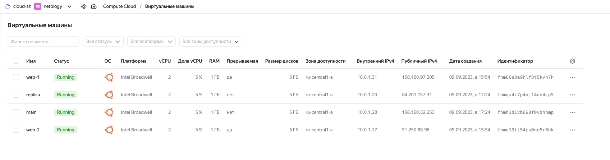
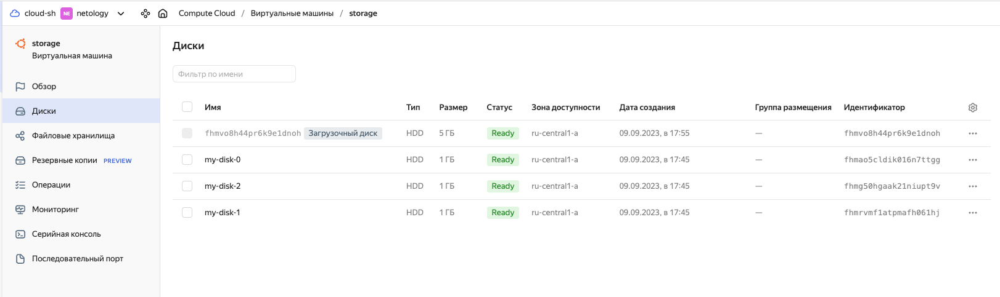

# Домашнее задание к занятию «Управляющие конструкции в коде Terraform»

### Задание 1

#### 1. Изучите проект.
```
выполнено
```

#### 2. Заполните файл personal.auto.tfvars.
копируем с предидущего задания:

```bash
cp ../../7.2\ Основы\ Terraform.\ Yandex\ Cloud/src/personal.auto.tfvars .
```

#### 3. Инициализируйте проект, выполните код. Он выполнится, даже если доступа к preview нет.

```bash
➜  src git:(main) ✗ terraform init

Initializing the backend...

Initializing provider plugins...
- Reusing previous version of yandex-cloud/yandex from the dependency lock file
- Using previously-installed yandex-cloud/yandex v0.97.0

Terraform has been successfully initialized!

You may now begin working with Terraform. Try running "terraform plan" to see
any changes that are required for your infrastructure. All Terraform commands
should now work.

If you ever set or change modules or backend configuration for Terraform,
rerun this command to reinitialize your working directory. If you forget, other
commands will detect it and remind you to do so if necessary.
```

```bash
➜  src git:(main) ✗ terraform apply
```

Приложите скриншот входящих правил «Группы безопасности» в ЛК Yandex Cloud или скриншот отказа в предоставлении доступа к preview-версии.



------

### Задание 2

#### 1. Создайте файл count-vm.tf. Опишите в нём создание двух **одинаковых** ВМ  web-1 и web-2 (не web-0 и web-1) с минимальными параметрами, используя мета-аргумент **count loop**. Назначьте ВМ созданную в первом задании группу безопасности.(как это сделать узнайте в документации провайдера yandex/compute_instance )

`count-vm.tf:`

```bash
data "yandex_compute_image" "ubuntu" {
  family = var.vm_web_ubuntu_image
}

resource "yandex_compute_instance" "platform" {
  count       = var.count_web
  name        = "${var.vm_name_platform}-${count.index + 1}"
  platform_id = var.vm_web_platform_id
  resources {
    cores         = var.vm_resources["web"]["cores"]
    memory        = var.vm_resources["web"]["memory"]
    core_fraction = var.vm_resources["web"]["core_fraction"]
  }
  boot_disk {
    initialize_params {
      image_id = data.yandex_compute_image.ubuntu.image_id
    }
  }
  
  scheduling_policy {
    preemptible = true
  }
  
  network_interface {
    subnet_id          = yandex_vpc_subnet.develop.id
    nat                = true
    security_group_ids = [yandex_vpc_security_group.example.id]
  }
  
  metadata = {
    serial-port-enable = 1
    ssh-keys           = "ubuntu:${var.vms_ssh_root_key}"
  }

}
```

#### 2. Создайте файл for_each-vm.tf. Опишите в нём создание двух ВМ с именами "main" и "replica" **разных** по cpu/ram/disk , используя мета-аргумент **for_each loop**. Используйте для обеих ВМ одну общую переменную типа list(object({ vm_name=string, cpu=number, ram=number, disk=number  })). При желании внесите в переменную все возможные параметры.

`variables.tf`

```bash
# создаем main и replica, задание 2.2

variable "vm_instances" {
  type = map(object({
    vm_name       = string
    cpu           = number
    ram           = number
    core_fraction = number
  }))
  default = {
    main = {
      vm_name       = "main"
      cpu           = 2
      ram           = 1
      core_fraction = 5
    }
    replica = {
      vm_name       = "replica"
      cpu           = 2
      ram           = 1
      core_fraction = 5
    }
  }
}
```

`for_each-vm.tf`

```bash
resource "yandex_compute_instance" "vm" {
  for_each    = var.vm_instances
  name        = each.value.vm_name
  platform_id = var.vm_web_platform_id

  resources {
    cores         = each.value.cpu
    memory        = each.value.ram
    core_fraction = each.value.core_fraction
  }

  boot_disk {
    initialize_params {
      image_id = data.yandex_compute_image.ubuntu.image_id
    }
  }

  network_interface {
    subnet_id          = yandex_vpc_subnet.develop.id
    nat                = true
    security_group_ids = [yandex_vpc_security_group.example.id]
  }
}

```

#### 3. ВМ из пункта 2.2 должны создаваться после создания ВМ из пункта 2.1.

в файл `for_each-vm.tf` добавляем `depends_on = [ yandex_compute_instance.platform ]`

#### 4. Используйте функцию file в local-переменной для считывания ключа ~/.ssh/id_rsa.pub и его последующего использования в блоке metadata, взятому из ДЗ 2.

меняем файл `for_each-vm.tf`

```bash
locals {
  ssh_public_key = file("~/.ssh/id_rsa.pub")
}

resource "yandex_compute_instance" "vm" {
  depends_on  = [yandex_compute_instance.platform]
  for_each    = var.vm_instances
  name        = each.value.vm_name
  platform_id = var.vm_web_platform_id

  resources {
    cores         = each.value.cpu
    memory        = each.value.ram
    core_fraction = each.value.core_fraction
  }

  boot_disk {
    initialize_params {
      image_id = data.yandex_compute_image.ubuntu.image_id
    }
  }

  network_interface {
    subnet_id          = yandex_vpc_subnet.develop.id
    nat                = true
    security_group_ids = [yandex_vpc_security_group.example.id]
  }

  metadata = {
    ssh-keys = local.ssh_public_key
  }
}
```

#### 5. Инициализируйте проект, выполните код.

```
terraform apply
```


------

### Задание 3

#### 1. Создайте 3 одинаковых виртуальных диска размером 1 Гб с помощью ресурса yandex_compute_disk и мета-аргумента count в файле **disk_vm.tf** .

`disk_vm.tf`:
```bash
resource "yandex_compute_disk" "disks" {
  count = 3
  name  = "my-disk-${count.index}"
  size  = 1

}
```

```bash
terraform apply
```

#### 2. Создайте в том же файле **одиночную**(использовать count или for_each запрещено из-за задания №4) ВМ c именем "storage"  . Используйте блок **dynamic secondary_disk{..}** и мета-аргумент for_each для подключения созданных вами дополнительных дисков.

изменяем файл `disk_vm.tf`:
```bash
resource "yandex_compute_disk" "disks" {
  count = 3
  name  = "my-disk-${count.index}"
  size  = 1

}


resource "yandex_compute_instance" "storage" {
  name        = "storage"
  platform_id = var.vm_web_platform_id

  resources {
    cores         = 2
    memory        = 1
    core_fraction = 5
  }

  boot_disk {
    initialize_params {
      image_id = data.yandex_compute_image.ubuntu.image_id
    }
  }

  network_interface {
    subnet_id          = yandex_vpc_subnet.develop.id
    nat                = true
    security_group_ids = [yandex_vpc_security_group.example.id]
  }

  dynamic "secondary_disk" {
    for_each = yandex_compute_disk.disks
    content {
      device_name = secondary_disk.value.name
      disk_id     = secondary_disk.value.id
    }
  }

}

```

```bash
terraform apply
```

------

### Задание 4

#### 1. В файле ansible.tf создайте inventory-файл для ansible.
Используйте функцию tepmplatefile и файл-шаблон для создания ansible inventory-файла из лекции.
Готовый код возьмите из демонстрации к лекции [**demonstration2**](https://github.com/netology-code/ter-homeworks/tree/main/03/demonstration2).
Передайте в него в качестве переменных группы виртуальных машин из задания 2.1, 2.2 и 3.2, т. е. 5 ВМ.

#### 2. Инвентарь должен содержать 3 группы [webservers], [databases], [storage] и быть динамическим, т. е. обработать как группу из 2-х ВМ, так и 999 ВМ.

Вот тут мало что понятно. <br>

Я копирую кусок кода из проекта с демонстрацией. Теперь файл main.tf выглядит так:

```bash
resource "yandex_vpc_network" "develop" {
  name = var.vpc_name
}
resource "yandex_vpc_subnet" "develop" {
  name           = var.vpc_name
  zone           = var.default_zone
  network_id     = yandex_vpc_network.develop.id
  v4_cidr_blocks = var.default_cidr
}


# добавляем кусок кода с другого проекта

resource "null_resource" "web_hosts_provision" {


  #Добавление ПРИВАТНОГО ssh ключа в ssh-agent
  provisioner "local-exec" {
    command = "cat ~/.ssh/id_rsa | ssh-add -"
  }

  #Костыль!!! Даем ВМ 60 сек на первый запуск. Лучше выполнить это через wait_for port 22 на стороне ansible
  # В случае использования cloud-init может потребоваться еще больше времени
  provisioner "local-exec" {
    command = "sleep 60"
  }

  #Запуск ansible-playbook
  provisioner "local-exec" {
    command     = "export ANSIBLE_HOST_KEY_CHECKING=False; ansible-playbook -i ${abspath(path.module)}/hosts.cfg ${abspath(path.module)}/test.yml"
    on_failure  = continue #Продолжить выполнение terraform pipeline в случае ошибок
    environment = { ANSIBLE_HOST_KEY_CHECKING = "False" }
    #срабатывание триггера при изменении переменных
  }
  triggers = {
    always_run        = "${timestamp()}"                         #всегда т.к. дата и время постоянно изменяются
    playbook_src_hash = file("${abspath(path.module)}/test.yml") # при изменении содержимого playbook файла
    ssh_public_key    = var.vms_ssh_root_key                     # при изменении переменной
  }

}

```

После создаю `ansible_inventory_template.tpl`

```bash
[webservers]
%{~ for i in webservers ~}
${i["name"]} ansible_host=${i["network_interface"][0]["nat_ip_address"]} 
%{~ endfor ~}
[databases]
%{~ for i in databases ~}
${i["name"]} ansible_host=${i["network_interface"][0]["nat_ip_address"]} 
%{~ endfor ~}
[storage]
%{~ for i in storage ~}
${i["name"]} ansible_host=${i["network_interface"][0]["nat_ip_address"]} 
%{~ endfor ~}
```

Теперь нужно каким то образом "Передайте в него в качестве переменных группы виртуальных машин из задания 2.1, 2.2 и 3.2, т. е. 5 ВМ."

Как это сделать?

#### 3. Выполните код. Приложите скриншот получившегося файла. 

Для общего зачёта создайте в вашем GitHub-репозитории новую ветку terraform-03. Закоммитьте в эту ветку свой финальный код проекта, пришлите ссылку на коммит.   
**Удалите все созданные ресурсы**.

------

### Задание 5* (необязательное)
#### 1. Напишите output, который отобразит все 5 созданных ВМ в виде списка словарей:
``` 
[
 {
  "name" = 'имя ВМ1'
  "id"   = 'идентификатор ВМ1'
  "fqdn" = 'Внутренний FQDN ВМ1'
 },
 {
  "name" = 'имя ВМ2'
  "id"   = 'идентификатор ВМ2'
  "fqdn" = 'Внутренний FQDN ВМ2'
 },
 ....
]
```
Приложите скриншот вывода команды ```terrafrom output```.

если код в `outouts.tf` такой:

```bash
output "web" {
  value = [
    for vm in yandex_compute_instance.platform :
    {
      "name" = vm.name
      "id"   = vm.id
      "fqdn" = vm.network_interface[0].nat_ip_address
    }
  ]

}

output "main_and_replica" {
  value = [
    for vm in yandex_compute_instance.vm :
    {
      "name" = vm.name
      "id"   = vm.id
      "fqdn" = vm.network_interface[0].nat_ip_address
    }
  ]

}
```

то при `terraform apply` получаем:

```bash
Apply complete! Resources: 0 added, 0 changed, 0 destroyed.

Outputs:

main_and_replica = [
  {
    "fqdn" = "158.160.32.253"
    "id" = "fhmh1d1vb668f0vdhhmp"
    "name" = "main"
  },
  {
    "fqdn" = "84.201.157.31"
    "id" = "fhmga4c7p4oj14nn4ip5"
    "name" = "replica"
  },
]
web = [
  {
    "fqdn" = "158.160.97.205"
    "id" = "fhm66e3e9hlf8t5kvh7h"
    "name" = "web-1"
  },
  {
    "fqdn" = "51.250.88.96"
    "id" = "fhmq19ti54cu0ne5r6hk"
    "name" = "web-2"
  },
]
```


чтобы вывести остальные 5-ую ВМ добавляем код:
```bash
output "web" {
  value = [
    for vm in yandex_compute_instance.platform :
    {
      "name" = vm.name
      "id"   = vm.id
      "fqdn" = vm.network_interface[0].nat_ip_address
    }
  ]

}

output "main_and_replica" {
  value = [
    for vm in yandex_compute_instance.vm :
    {
      "name" = vm.name
      "id"   = vm.id
      "fqdn" = vm.network_interface[0].nat_ip_address
    }
  ]

}

output "storage" {
  value = [
    for vm in yandex_compute_instance.storage :
    {
      "name" = vm.name
      "id"   = vm.id
      "fqdn" = vm.network_interface[0].nat_ip_address
    }
  ]

}
```

Получаем ошибку:
```bash

│ Error: Unsupported attribute
│ 
│   on outputs.tf line 31, in output "storage":
│   31:       "fqdn" = vm.network_interface[0].nat_ip_address
│ 
│ Can't access attributes on a list of objects. Did you mean to access an attribute for a specific element of the list, or across all elements of the list?
```

Не могу понять вы чем дело. 
Все ВМ имеют одинаковые сетевые параметры:

```bash
 network_interface {
    subnet_id          = yandex_vpc_subnet.develop.id
    nat                = true
    security_group_ids = [yandex_vpc_security_group.example.id]
  }
  ```

------

### Задание 6* (необязательное)

```
еще не делал, т.к. не понятно как выполнять предидущие задания
```

#### 1. Используя null_resource и local-exec, примените ansible-playbook к ВМ из ansible inventory-файла.
Готовый код возьмите из демонстрации к лекции [**demonstration2**](https://github.com/netology-code/ter-homeworks/tree/main/demonstration2).

#### 2. Дополните файл шаблон hosts.tftpl. 
Формат готового файла:
```netology-develop-platform-web-0   ansible_host="<внешний IP-address или внутренний IP-address если у ВМ отсутвует внешний адрес>"```

Для проверки работы уберите у ВМ внешние адреса. Этот вариант используется при работе через bastion-сервер.
Для зачёта предоставьте код вместе с основной частью задания.


