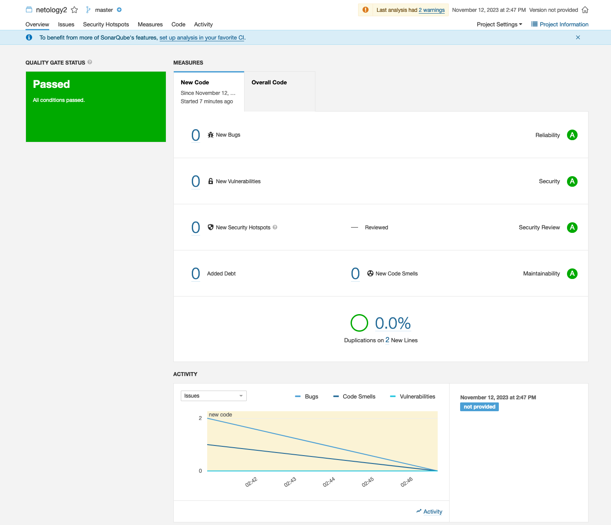

# Домашнее задание к занятию 9 «Процессы CI/CD»

## Подготовка к выполнению

1. Создайте два VM в Yandex Cloud с параметрами: 2CPU 4RAM Centos7 (остальное по минимальным требованиям).
```
выполнено
```

2. Пропишите в [inventory](./infrastructure/inventory/cicd/hosts.yml) [playbook](./infrastructure/site.yml) созданные хосты.

```
выполнено
```

3. Добавьте в [files](./infrastructure/files/) файл со своим публичным ключом (id_rsa.pub). Если ключ называется иначе — найдите таску в плейбуке, которая использует id_rsa.pub имя, и исправьте на своё.

```
выполнено
```

4. Запустите playbook, ожидайте успешного завершения.

```bash
PLAY RECAP ************************************************************************************************************************************************************
nexus-01                   : ok=17   changed=13   unreachable=0    failed=0    skipped=2    rescued=0    ignored=0   
sonar-01                   : ok=32   changed=9    unreachable=0    failed=0    skipped=3    rescued=0    ignored=0  
```

5. Проверьте готовность SonarQube через [браузер](http://localhost:9000).

```
выполнено
```

6. Зайдите под admin\admin, поменяйте пароль на свой.

```
выполнено, новый пароль FDn389fsn322
```

7.  Проверьте готовность Nexus через [бразуер](http://localhost:8081).

```
выполнено
```

8. Подключитесь под admin\admin123, поменяйте пароль, сохраните анонимный доступ.

```
выполнено
```

## Знакомоство с SonarQube

### Основная часть

1. Создайте новый проект, название произвольное.

```
выполнено
```

2. Скачайте пакет sonar-scanner, который вам предлагает скачать SonarQube.

```
выполнено
```

3. Сделайте так, чтобы binary был доступен через вызов в shell (или поменяйте переменную PATH, или любой другой, удобный вам способ).

```
выполнено
```

4. Проверьте `sonar-scanner --version`.

```
➜  example git:(main) ✗ sonar-scanner --version
INFO: Scanner configuration file: /Users/shl/Software/sonar-scanner-5.0.1.3006-macosx/conf/sonar-scanner.properties
INFO: Project root configuration file: NONE
INFO: SonarScanner 5.0.1.3006
INFO: Java 17.0.7 Eclipse Adoptium (64-bit)
INFO: Mac OS X 13.6 x86_64
```

5. Запустите анализатор против кода из директории [example](./example) с дополнительным ключом `-Dsonar.coverage.exclusions=fail.py`.


```
выполнено
```

6. Посмотрите результат в интерфейсе.


```
выполнено
```

7. Исправьте ошибки, которые он выявил, включая warnings.


```
выполнено
```

8. Запустите анализатор повторно — проверьте, что QG пройдены успешно.

```
выполнено
```

9.  Сделайте скриншот успешного прохождения анализа, приложите к решению ДЗ.



## Знакомство с Nexus

### Основная часть

1. В репозиторий `maven-public` загрузите артефакт с GAV-параметрами:

 *    groupId: netology;
 *    artifactId: java;
 *    version: 8_282;
 *    classifier: distrib;
 *    type: tar.gz.
   
```
выполнено
```

2. В него же загрузите такой же артефакт, но с version: 8_102.

```
выполнено
```

3. Проверьте, что все файлы загрузились успешно.

```
выполнено
```

4. В ответе пришлите файл `maven-metadata.xml` для этого артефекта.

```xml
<metadata modelVersion="1.1.0">
<groupId>netology</groupId>
<artifactId>java</artifactId>
<versioning>
<latest>8_282</latest>
<release>8_282</release>
<versions>
<version>8_102</version>
<version>8_282</version>
</versions>
<lastUpdated>20231112085332</lastUpdated>
</versioning>
</metadata>
```

### Знакомство с Maven

### Подготовка к выполнению

1. Скачайте дистрибутив с [maven](https://maven.apache.org/download.cgi).

```
выполнено
```

2. Разархивируйте, сделайте так, чтобы binary был доступен через вызов в shell (или поменяйте переменную PATH, или любой другой, удобный вам способ).

```
выполнено
```

3. Удалите из `apache-maven-<version>/conf/settings.xml` упоминание о правиле, отвергающем HTTP- соединение — раздел mirrors —> id: my-repository-http-unblocker.

```
выполнено
```

4. Проверьте `mvn --version`.

```bash
bin mvn -v
Apache Maven 3.9.5 (57804ffe001d7215b5e7bcb531cf83df38f93546)
Maven home: /Users/shlagin/Software/apache-maven-3.9.5
Java version: 1.8.0_391, vendor: Oracle Corporation, runtime: /Library/Internet Plug-Ins/JavaAppletPlugin.plugin/Contents/Home
Default locale: en_KZ, platform encoding: UTF-8
OS name: "mac os x", version: "13.6", arch: "x86_64", family: "mac"
```

5. Заберите директорию [mvn](./mvn) с pom.

### Основная часть

1. Поменяйте в `pom.xml` блок с зависимостями под ваш артефакт из первого пункта задания для Nexus (java с версией 8_282).

```bash
выполнено
```

2. Запустите команду `mvn package` в директории с `pom.xml`, ожидайте успешного окончания.

```bash
➜  mvn git:(main) ✗ mvn package
[INFO] Scanning for projects...
[INFO] 
[INFO] --------------------< com.netology.app:simple-app >---------------------
[INFO] Building simple-app 1.0-SNAPSHOT
[INFO]   from pom.xml
[INFO] --------------------------------[ jar ]---------------------------------
[WARNING] The POM for netology:java:tar.gz:distrib:8_282 is missing, no dependency information available
[INFO] 
[INFO] --- resources:3.3.1:resources (default-resources) @ simple-app ---
[WARNING] Using platform encoding (UTF-8 actually) to copy filtered resources, i.e. build is platform dependent!
[INFO] skip non existing resourceDirectory /Users/shlagin/Documents/DevOps-netology/homeweork-devops-netology/9.3_CI_CD/mvn/src/main/resources
[INFO] 
[INFO] --- compiler:3.11.0:compile (default-compile) @ simple-app ---
[INFO] No sources to compile
[INFO] 
[INFO] --- resources:3.3.1:testResources (default-testResources) @ simple-app ---
[WARNING] Using platform encoding (UTF-8 actually) to copy filtered resources, i.e. build is platform dependent!
[INFO] skip non existing resourceDirectory /Users/shlagin/Documents/DevOps-netology/homeweork-devops-netology/9.3_CI_CD/mvn/src/test/resources
[INFO] 
[INFO] --- compiler:3.11.0:testCompile (default-testCompile) @ simple-app ---
[INFO] No sources to compile
[INFO] 
[INFO] --- surefire:3.1.2:test (default-test) @ simple-app ---
[INFO] No tests to run.
[INFO] 
[INFO] --- jar:3.3.0:jar (default-jar) @ simple-app ---
[WARNING] JAR will be empty - no content was marked for inclusion!
[INFO] ------------------------------------------------------------------------
[INFO] BUILD SUCCESS
[INFO] ------------------------------------------------------------------------
[INFO] Total time:  0.866 s
[INFO] Finished at: 2023-11-13T21:27:03+07:00
[INFO] ------------------------------------------------------------------------
```

3. Проверьте директорию `~/.m2/repository/`, найдите ваш артефакт.

```bash
ls -lah ~/.m2/repository/netology/java/
total 0
drwxr-xr-x@ 3 shlagin  staff    96B Nov 13 21:26 .
drwxr-xr-x@ 3 shlagin  staff    96B Nov 13 21:26 ..
drwxr-xr-x@ 6 shlagin  staff   192B Nov 13 21:26 8_282
```

4. В ответе пришлите исправленный файл `pom.xml`.
   
```bash
<project xmlns="http://maven.apache.org/POM/4.0.0" xmlns:xsi="http://www.w3.org/2001/XMLSchema-instance"
  xsi:schemaLocation="http://maven.apache.org/POM/4.0.0 http://maven.apache.org/xsd/maven-4.0.0.xsd">
  <modelVersion>4.0.0</modelVersion>
 
  <groupId>com.netology.app</groupId>
  <artifactId>simple-app</artifactId>
  <version>1.0-SNAPSHOT</version>
   <repositories>
    <repository>
      <id>my-repo</id>
      <name>maven-public</name>
      <url>http://158.160.101.82:8081/repository/maven-public/</url>
    </repository>
  </repositories>
  <dependencies>
    <dependency>
      <groupId>netology</groupId>
      <artifactId>java</artifactId>
      <version>8_282</version>
      <classifier>distrib</classifier>
      <type>tar.gz</type>
    </dependency>
  </dependencies>
</project>
```

---


