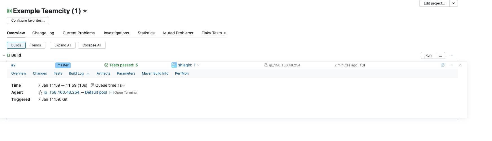
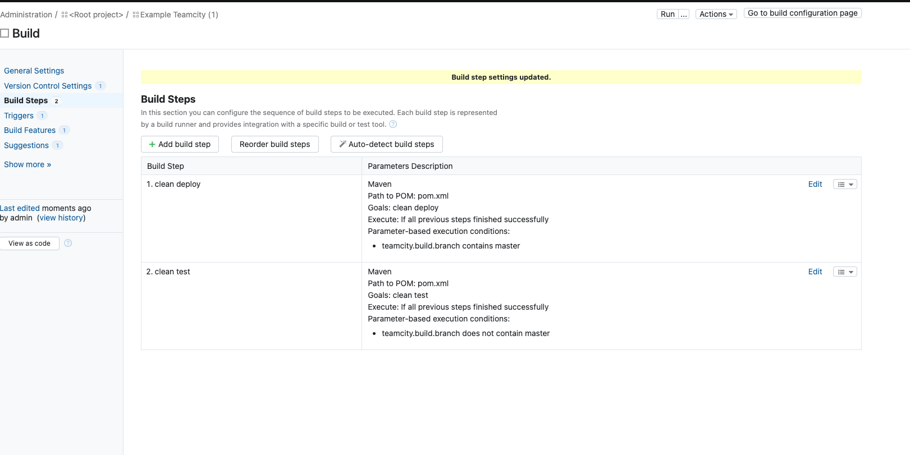
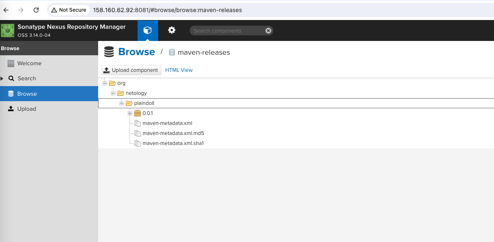
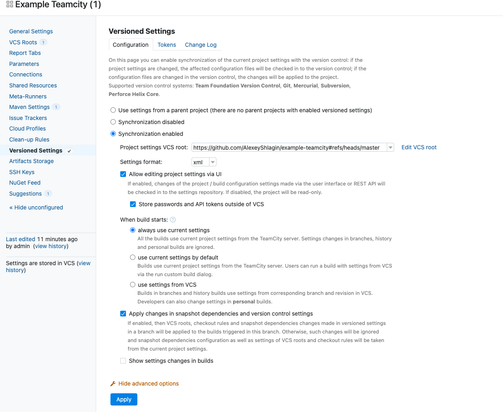
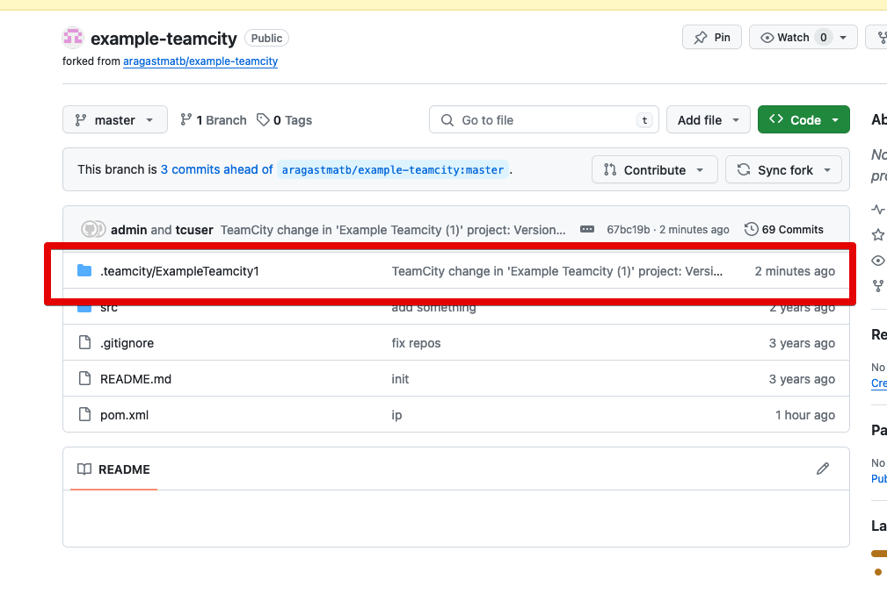
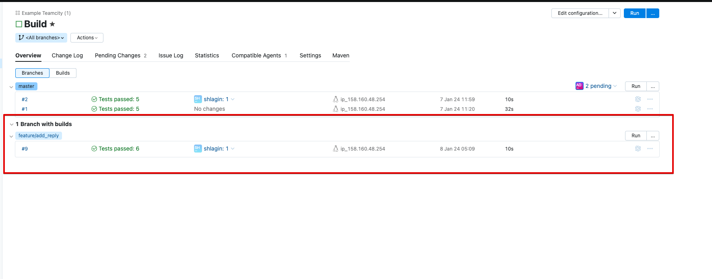
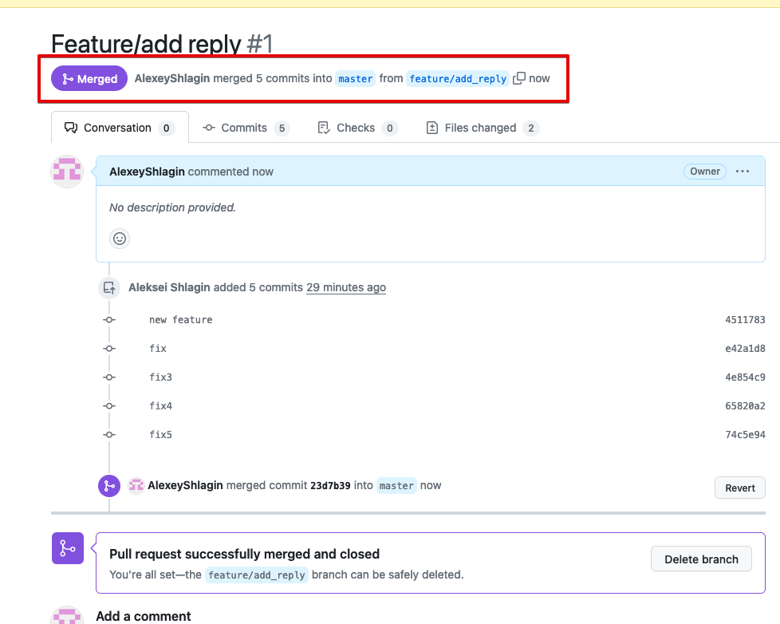
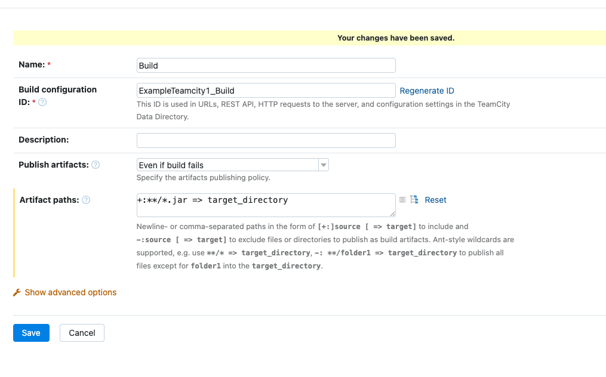
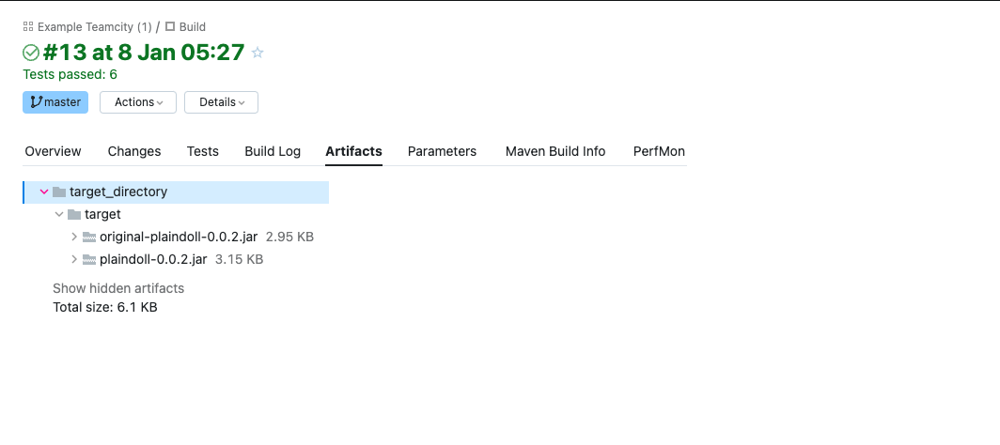
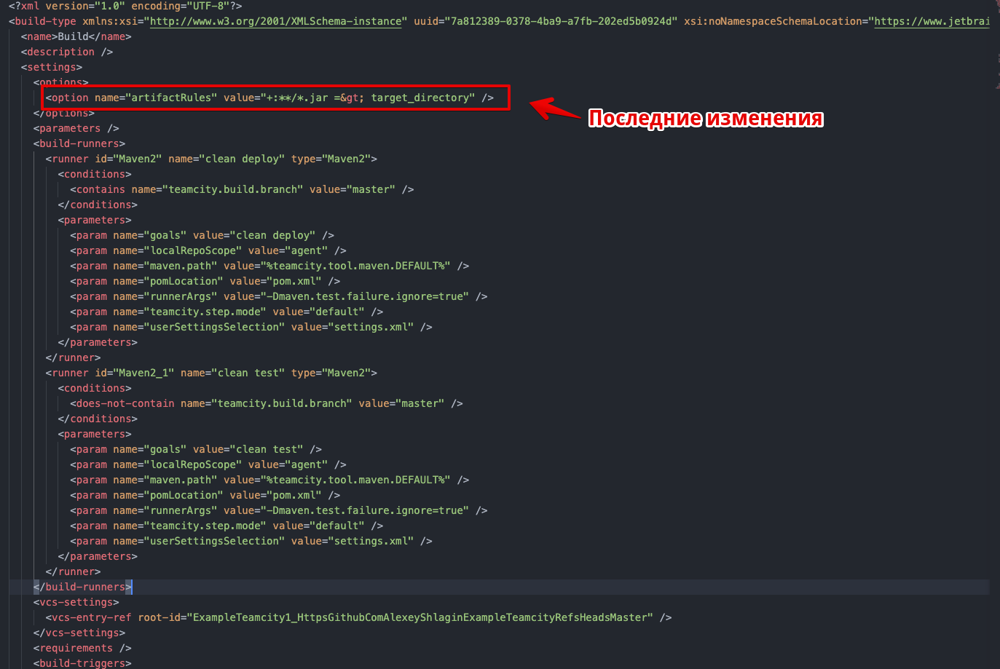

# Домашнее задание к занятию 11 «Teamcity»

## Подготовка к выполнению

1. В Yandex Cloud создайте новый инстанс (4CPU4RAM) на основе образа `jetbrains/teamcity-server`.

```bash
выполнено
```

2. Дождитесь запуска teamcity, выполните первоначальную настройку.

```bash
выполнено
```

3. Создайте ещё один инстанс (2CPU4RAM) на основе образа `jetbrains/teamcity-agent`. Пропишите к нему переменную окружения `SERVER_URL: "http://<teamcity_url>:8111"`.

```bash
выполнено
```

4. Авторизуйте агент.

```bash
выполнено
```

5. Сделайте fork [репозитория](https://github.com/aragastmatb/example-teamcity).

```bash
выполнено
```

6. Создайте VM (2CPU4RAM) и запустите [playbook](./infrastructure).

```bash
ansible-playbook -i inventory/cicd site.yml
....
....
PLAY RECAP *************************************************************************************************************************************************************************************************************
nexus-01                   : ok=17   changed=15   unreachable=0    failed=0    skipped=2    rescued=0    ignored=0   
```

## Основная часть

1. Создайте новый проект в teamcity на основе fork.

```bash
выполнено
```

2. Сделайте autodetect конфигурации.

```bash
выполнено
```

3. Сохраните необходимые шаги, запустите первую сборку master.



4. Поменяйте условия сборки: если сборка по ветке `master`, то должен происходит `mvn clean deploy`, иначе `mvn clean test`.



5. Для deploy будет необходимо загрузить [settings.xml](./teamcity/settings.xml) в набор конфигураций maven у teamcity, предварительно записав туда креды для подключения к nexus.

```bash
выполнено
```

6. В pom.xml необходимо поменять ссылки на репозиторий и nexus.

```bash
выполнено
```

7. Запустите сборку по master, убедитесь, что всё прошло успешно и артефакт появился в nexus.



8. Мигрируйте `build configuration` в репозиторий.




9. Создайте отдельную ветку `feature/add_reply` в репозитории.

```bash
> git checkout -b feature/add_reply

Switched to a new branch 'feature/add_reply'
```

10. Напишите новый метод для класса Welcomer: метод должен возвращать произвольную реплику, содержащую слово `hunter`.

```bash
Рpackage plaindoll;

public class Welcomer{
	public String sayWelcome() {
		return "Welcome home, good hunter. What is it your desire?";
	}
	public String sayFarewell() {
		return "Farewell, good hunter. May you find your worth in waking world.";
	}
	public String sayNeedGold(){
		return "Not enough gold";
	}
	public String saySome(){
		return "something in the way";
	}
	public String sayHunter(){
		return "Good evening my darling. How can i get to the library?";
	}
}

```

11. Дополните тест для нового метода на поиск слова `hunter` в новой реплике.

```bash
...
...
...
	@Test
	public void welcomerSaysHunter(){
		assertThat(welcomer.sayHunter(), containsString("hunter"));
	}
```

12. Сделайте push всех изменений в новую ветку репозитория.

```bash
> git push origin feature/add_reply
Enumerating objects: 357, done.
Counting objects: 100% (357/357), done.
Delta compression using up to 14 threads
Compressing objects: 100% (147/147), done.
Writing objects: 100% (357/357), 47.04 KiB | 47.04 MiB/s, done.
Total 357 (delta 118), reused 340 (delta 113), pack-reused 0
```


13. Убедитесь, что сборка самостоятельно запустилась, тесты прошли успешно.



14. Внесите изменения из произвольной ветки `feature/add_reply` в `master` через `Merge`.



15. Убедитесь, что нет собранного артефакта в сборке по ветке `master`.

16. Настройте конфигурацию так, чтобы она собирала `.jar` в артефакты сборки.



17. Проведите повторную сборку мастера, убедитесь, что сбора прошла успешно и артефакты собраны.



18. Проверьте, что конфигурация в репозитории содержит все настройки конфигурации из teamcity.

Проверил, последние изменения есть



[ExampleTeamcity1_Build.xml](https://github.com/AlexeyShlagin/example-teamcity/blob/master/.teamcity/ExampleTeamcity1/buildTypes/ExampleTeamcity1_Build.xml)

19. В ответе пришлите ссылку на репозиторий.

[github example-teamcity](https://github.com/AlexeyShlagin/example-teamcity/tree/master)

